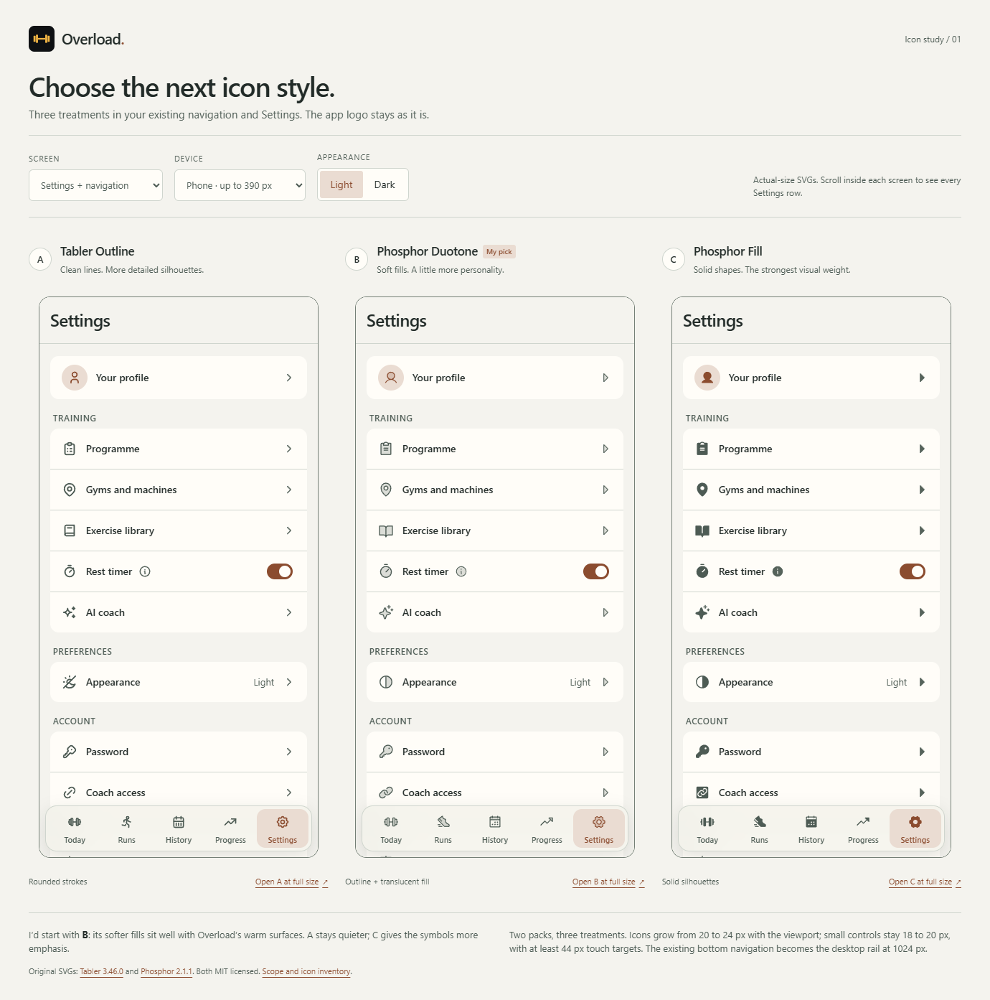

# Overload icon directions

Three reviewable icon treatments, based on `main` at `c35892d`. **Awaiting the user's choice before replacing production icons.**

| Direction | Pack / treatment                                                  | Character                                                                       |
| --------- | ----------------------------------------------------------------- | ------------------------------------------------------------------------------- |
| A         | [Tabler Outline](https://github.com/tabler/tabler-icons), 3.46.0  | Rounded strokes, more detailed silhouettes                                      |
| B         | [Phosphor Duotone](https://github.com/phosphor-icons/core), 2.1.1 | Outlines with soft translucent fills; recommended for the existing warm palette |
| C         | Phosphor Fill, 2.1.1                                              | Solid silhouettes with more visual weight                                       |

These are two icon packs and three treatments. All previews use the actual upstream SVGs, with no runtime CDN, icon font, or new application dependency. Licenses are retained in [licenses](licenses/); pinned package versions and tarball integrity values are in [sources.json](sources.json).

## Review

From the repository root, run:

```sh
node docs/icon-refresh/serve.mjs
```

Open [the comparison](http://127.0.0.1:4176/docs/icon-refresh/index.html). The optional first argument selects a different port.

- Switch between Settings and the complete icon inventory.
- Compare light and dark mode, and phone, tablet, and desktop viewports.
- Open any direction at full size and resize the browser to inspect its responsive behavior.
- Tap navigation to preview each selected state. The Settings content stays visible for comparison.
- The rest timer switch and appearance row only change the local mockup. Other rows show a preview notice.

Phone frames fit their available width, up to 390 px. Tablet and desktop frames have actual 768 px and 1280 px viewports, with internal horizontal scrolling when the review window is narrower. The app itself has no horizontal overflow at the checked widths. SVGs are never scaled as part of a flattened screenshot inside the interactive preview.

The lightweight server binds to loopback and serves this review directory plus the three shared visual assets it needs. It does not run Next.js or connect to an account or database. Open the HTTP link; the parent/frame controls require the same origin and are not intended for `file://` use.

## Screenshots



- [Dark comparison](screenshots/comparison-dark.png)
- [Icon inventory in dark mode](screenshots/inventory-dark.png) — scroll in the interactive version for the remaining controls.
- [Duotone phone, dark](screenshots/duotone-phone-dark.png)
- [Duotone tablet, light](screenshots/duotone-tablet-light.png)
- [Duotone desktop, dark](screenshots/duotone-desktop-dark.png)

## Scope

This PR contains mockups and documentation only. The production components, dependencies, app behavior, and visual tokens have no changes.

The previews import the existing `foundation.css` and `form.css` palettes and reproduce the existing Settings groups, five navigation labels, content width, and 1024 px navigation breakpoint. Only sample profile/appearance values and preview controls are introduced. They are HTML approximations of the existing components, not live account screens.

**Keep the app's identity intact during the later rollout:**

- `src/app/icon.svg`, `src/app/apple-icon.png`, and `public/icons/*`
- The Overload wordmark and accent full stop
- The dumbbell used as the app mark in `src/app/(auth)/layout.tsx`; the same Lucide glyph's functional Today/gym uses can be replaced independently
- The existing app mark on the offline screen

The body map and chart SVGs represent data, not interface logos, and are outside this icon replacement. Mathematical multiplication signs and prose arrows also remain text. The two inline workout confirmation checkmarks should use the chosen `Check` symbol during implementation.

## Complete icon inventory

The 28 unique runtime Lucide imports under `src` are covered. `icons.js` includes the current file usage list and exact upstream asset path for every entry. The `Dumbbell` file list includes the protected auth branding use described above.

| Current symbol    | Purpose            | A: Tabler              | B/C: Phosphor      |
| ----------------- | ------------------ | ---------------------- | ------------------ |
| Dumbbell          | Today / workout    | barbell                | barbell            |
| Footprints        | Runs               | run                    | sneaker-move       |
| CalendarDays      | History / calendar | calendar-month         | calendar-dots      |
| TrendingUp        | Progress           | trending-up            | trend-up           |
| Settings          | Settings           | settings               | gear-six           |
| User              | Profile            | user                   | user               |
| ClipboardList     | Programme          | clipboard-list         | clipboard-text     |
| MapPin            | Gyms / location    | map-pin                | map-pin            |
| BookOpen          | Exercise library   | book-2                 | book-open          |
| Timer             | Rest timer         | stopwatch              | timer              |
| Sparkles          | AI coach           | sparkles               | sparkle            |
| SunMoon           | Appearance         | sun-moon               | circle-half        |
| KeyRound          | Password           | key                    | key                |
| Link2             | Coach access       | link                   | link               |
| Download          | Install            | download               | download-simple    |
| LogOut            | Sign out           | logout                 | sign-out           |
| Trash             | Delete account     | trash                  | trash              |
| ChevronRight      | Forward            | chevron-right          | caret-right        |
| ChevronLeft       | Back               | chevron-left           | caret-left         |
| ChevronDown       | Expand / select    | chevron-down           | caret-down         |
| Check             | Selected / saved   | check                  | check              |
| CheckCircle2      | Success            | circle-check           | check-circle       |
| Info              | Help               | info-circle            | info               |
| Search            | Search             | search                 | magnifying-glass   |
| SlidersHorizontal | Filters            | adjustments-horizontal | sliders-horizontal |
| ExternalLink      | External resource  | external-link          | arrow-square-out   |
| LoaderCircle      | Loading            | loader-2               | circle-notch       |
| MailCheck         | Email confirmation | mail-check             | envelope-open      |

The Phosphor email symbol is an opened envelope, not a checkmarked envelope. The existing confirmation text carries the success meaning. The pack-specific Runs and Appearance silhouettes are deliberately visible in the comparison.

## Responsive behavior proposed for implementation

- Navigation icons: `clamp(1.25rem, 1.125rem + 0.5vw, 1.5rem)` (20–24 px at default text size).
- Leading Settings icons: `clamp(1.375rem, 1.25rem + 0.5vw, 1.5rem)` (22–24 px).
- Small controls: `clamp(1.125rem, 1.0625rem + 0.25vw, 1.25rem)` (18–20 px).
- Every SVG retains its native viewBox, inherits `currentColor`, and is hidden from assistive technology when the surrounding control supplies the label.
- Navigation cells and icon buttons remain at least 44 × 44 px; Settings rows stay at least 56 px tall. The glyph size is separate from the hit target.
- Bottom navigation below 1024 px; the existing 192 px desktop rail at and above 1024 px. The page reserves navigation space and safe-area insets.
- Text labels and the selected background accompany icons; meaning does not depend on color alone. Focus outlines and forced-color fallbacks are included. The mockups have no animation.

After a direction is selected, apply its family and sizing consistently to the functional usages in this inventory, including the shared row, navigation, form, loading, and empty-state components. Keep the protected brand usages intact. The production rollout will need its own component and browser verification.

## Verification

Checked on 11 September 2026 in headless Microsoft Edge (Chromium), using Playwright:

- 30 Settings combinations: 3 treatments × 2 themes × widths 320, 390, 768, 1024, and 1440 px.
- No page overflow, missing/empty SVGs, or browser errors; all mockup touch targets meet the minimum; the final Settings row clears navigation.
- Correct bottom bar/desktop rail behavior and fluid SVG sizing (20 px navigation at 320/390; about 21.8 at 768; 23.1 at 1024; 24 at 1440).
- All 28 symbols render in each inventory; review theme/screen/device controls work, including real 768/1280 px frame widths.
- Keyboard activation of navigation; local rest switch and appearance change; focus restored after the appearance repaint.
- No horizontal overflow with 200% text sizing at 320, 768, and 1440 px.
- ESLint for the review scripts and Prettier for this directory pass.

Screenshots were visually inspected. These checks emulate viewport sizes; they are not physical iOS/Android or Safari testing. The production test suite was not run because no production source or dependencies changed.
