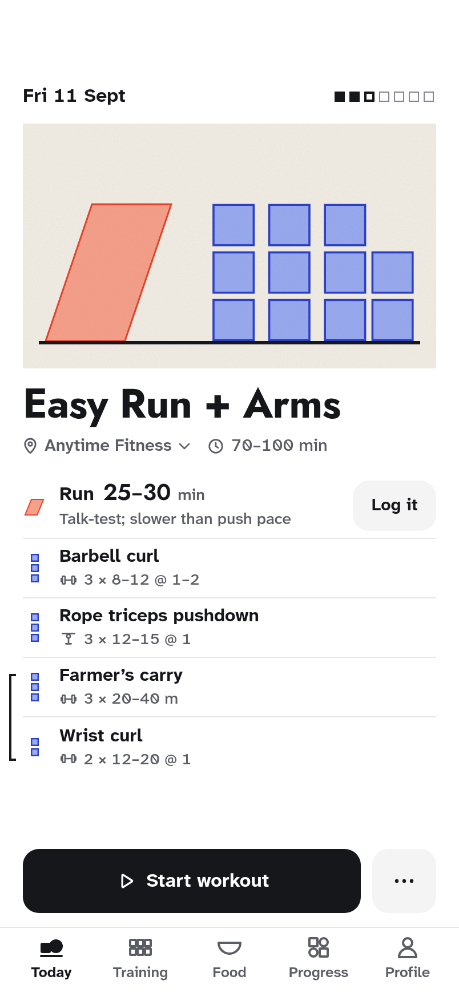
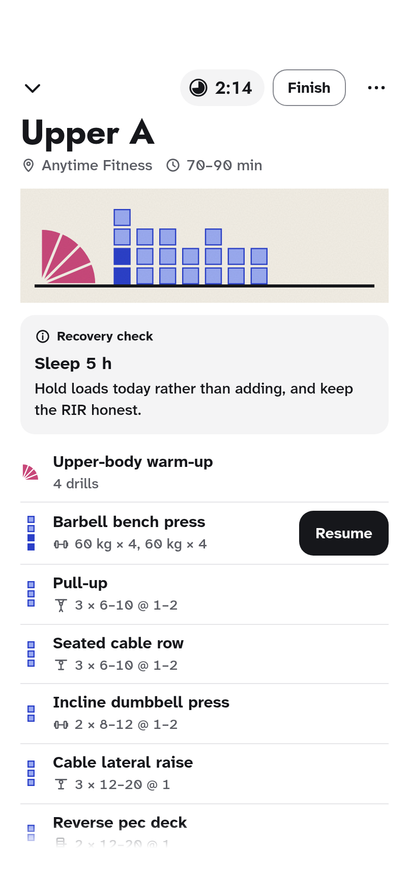
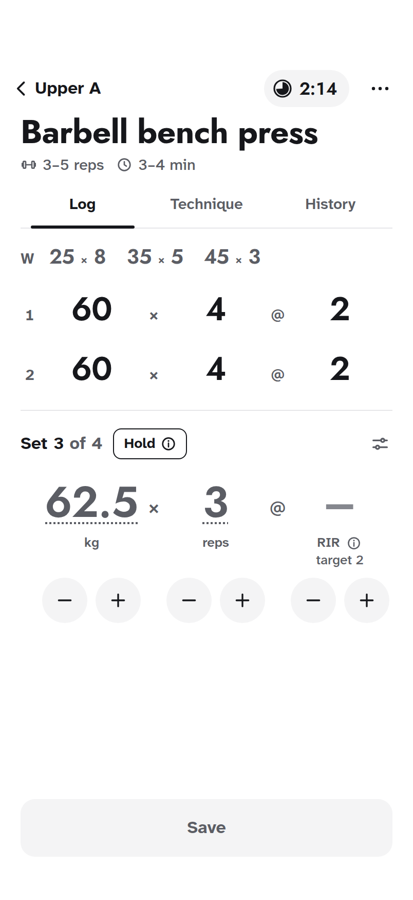
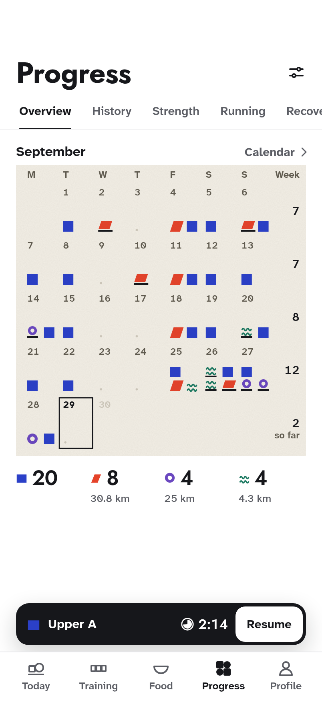
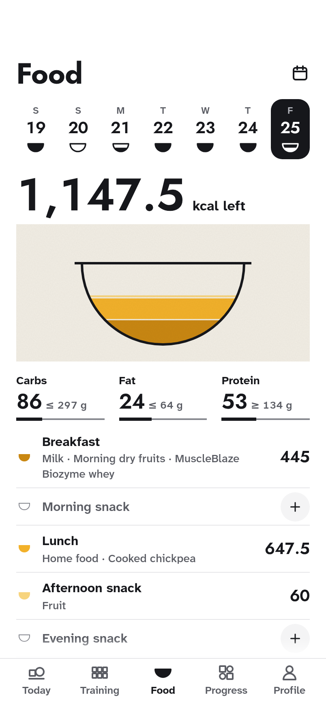
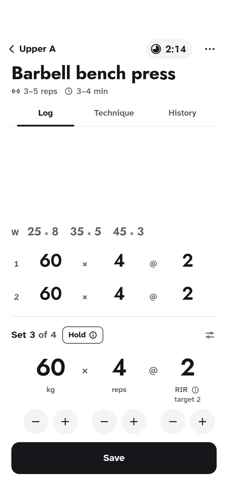
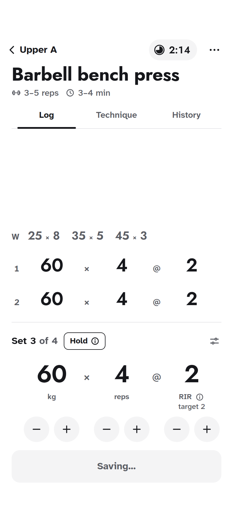
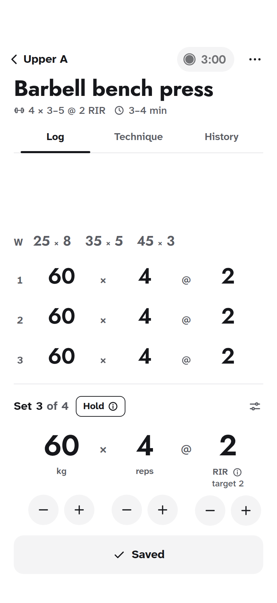
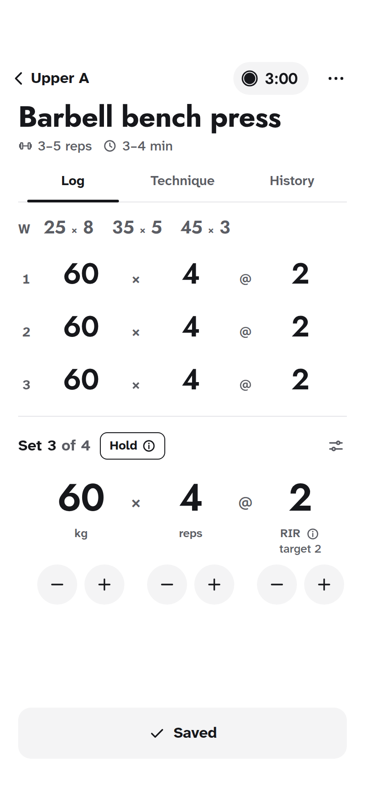
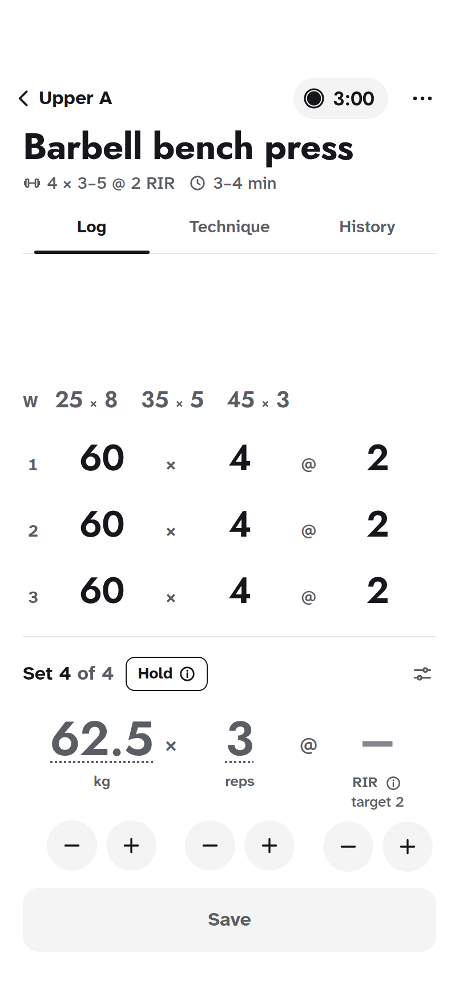

# Form v2: the art is your training

The revamp's direction, refined on the Claude Design canvas **Overload revamp: Form v2, refined**
(2 October 2026) and kept here with its source, tokens and screenshots. Nothing in the
application has changed. The revamp's [`PRODUCT.md`](../../../../PRODUCT.md) and
[`DESIGN.md`](../../../../DESIGN.md), at the repository root, record the product and this design
system; this folder is the evidence they point to.

Form v2 replaces the current interface, Form ([decision 0013](../../../decisions/0013-form-interface.md)),
and shares nothing with its look.

<p>
  
  
  
  
  
</p>

## The idea

A black-and-white app that stays out of the way. Every colour on screen is a print: generative,
Bauhaus-like art drawn from what the account has logged and nothing else, so the art is the
record and the reward at once. How the body moves gives the form and its pigment: a block for
load, a track for on foot, a wheel for on wheels, a wave for in water, a fan for practice, a
bowl for food. Thinned pigment with an edge is still to do; full is done; a dashed edge is
skipped. Every form stands on one module grid and one baseline, with nothing drawn under it, and
the composition sits in the middle of its paper. A print carries no words; the rows under it name
its parts in the same order.

## What changed in this refinement

The canvas was redrawn from scratch after the owner's notes on the first version, then reworked
after the notes on the second. The latest notes first:

| The note                                                     | What the boards do now                                                                                                                                                            |
| ------------------------------------------------------------ | --------------------------------------------------------------------------------------------------------------------------------------------------------------------------------- |
| No boxes or art beside an exercise's name                    | A row is the name and its prescription; the sets are said once in words and drawn once in the print. Marks lead a row only where a list mixes sports                              |
| Logging is garbage: rethink it; keep the timer and the entry | Log is the sets so far: the warm-ups on one line, each set done a line of figures in the entry's columns, so the entry reads as the next line. No boxes, no rows for sets to come |
| Training's art is left-aligned: centre it                    | Every print is centred on its paper                                                                                                                                               |
| A better shape for running; that line goes everywhere        | Running is a track (a stadium with its lane), a module longer for every 20 minutes; on a platform it is a treadmill. No line under any print                                      |
| The calendar looks bad: the old one was better               | The old calendar's paper, weekday letters, dots and marks, for one month; a day's marks stand together, one to four; the calendar page adds dates                                 |
| The Running page's art is horrible                           | Progress charts are ink: grey bars, this week in ink, scale labels in a margin; each run says treadmill or outdoors with a glyph                                                  |
| Food: show what was eaten                                    | The day's one figure is the kcal eaten; the bowl shows where that stands                                                                                                          |
| Why was the score low? Fix the verdicts                      | See How it was checked                                                                                                                                                            |

And the earlier notes, as the canvas answers them now:

| The note                                                     | What the boards do now                                                                                                              |
| ------------------------------------------------------------ | ----------------------------------------------------------------------------------------------------------------------------------- |
| Better art for runs, cycling and other sports; fix alignment | A new alphabet on one module grid and one baseline: block, track, wheel, wave, fan, bowl                                            |
| Keep the cycle and the rest timer minimal                    | The cycle is seven squares; rest is one pill, a dial that empties from twelve                                                       |
| Minimal text, nothing repeated                               | No words on prints; state said only when it is news (a check, Resume, Skipped); each fact once per screen                           |
| Revamp logging; Log, Technique, History; warm-ups faded      | Log, Technique and History tabs; History lists every session in the same lines as Log; warm-ups are grey                            |
| RIR as minus, a figure, plus                                 | RIR is a stepper that starts empty, its target beside it: tap the dash for the target, − or + for one either side                   |
| Equipment and outdoor or treadmill as icons                  | Glyphs for free weights (a dumbbell), machine, cable, Smith machine, bodyweight; outdoors, treadmill, indoor bike, pool, open water |
| Start everything at the left edge                            | Every name starts at the gutter; a superset's bracket stands in the gutter                                                          |
| Progress congested: one month, every activity, a calendar    | One month on paper, its marks and dots; the calendar scrolls month by month; a day opens on its print                               |
| Less padding under the tab bar                               | 64 pt: 44-pt targets ending 4 clear of the home indicator                                                                           |
| Over-full food without breaking the bowl                     | The food heaps above the rim as one symmetric mound                                                                                 |
| More pages, the coach among them                             | 74 boards: the AI coach and its proposed change, Training, Friends, Gyms, the first run, every Progress section and more            |
| Native apps; text never runs off                             | An iOS and Android board, Android-size boards, typed entry, wrap and fit rules                                                      |
| The weight chart's coloured point; blue text selection       | Both ink                                                                                                                            |

## What is here

| Path                                       | What it is                                                                                         |
| ------------------------------------------ | -------------------------------------------------------------------------------------------------- |
| [`screenshots/`](screenshots/)             | Every board (phone boards at 2×, wide boards at 1×) and five frames of the signature moment        |
| [`canvas/`](canvas/)                       | The 74 boards as on the canvas, and the `canvas.json` that places them on nine pages               |
| [`tokens/tokens.css`](tokens/tokens.css)   | Colour (light and dark), print palettes, fonts, radii, spacing and motion as CSS custom properties |
| [`tokens/tokens.json`](tokens/tokens.json) | The same, plus the type roles, the print grid and the layout rules                                 |
| [`source/`](source/)                       | The generator the boards are drawn with (below)                                                    |

`canvas/` and `tokens/` are written by `source/build.mjs`; change the source and rebuild rather
than editing them.

## The canvas

| Page                     | Boards                                                                                                                                                                                                                                |
| ------------------------ | ------------------------------------------------------------------------------------------------------------------------------------------------------------------------------------------------------------------------------------- |
| Read me                  | [What changed, how to read the canvas, where the figures come from, the critiques](screenshots/Main.png)                                                                                                                              |
| Today and the session    | Today, with the coach planning, More options, Check-in; the workout three ways, Add exercise, a fallback; logging (warm-ups, a set, typing a load, the ink moment, Why, Technique, History, a superset); Finish, the summary, offline |
| Training                 | Training, a programme day, logging a run, a ride and a swim, a run read back                                                                                                                                                          |
| Progress                 | The month, the calendar, a day, a past workout; History, Running, Recovery, Body, an exercise's whole life                                                                                                                            |
| Food                     | The day's bowl, over the target, adding to dinner, a portion                                                                                                                                                                          |
| Profile, coach, people   | Profile, Edit profile, Appearance, Privacy, Delete account; the AI coach, its proposed change, Friends, Gyms, a gym                                                                                                                   |
| First run                | Welcome, sports, a gym, its machines, a programme                                                                                                                                                                                     |
| Sizes, themes, platforms | Dark; 375 and 320 (pounds, whole scrolls); 440; Android 360 × 800; 200% text                                                                                                                                                          |
| System                   | [The system](screenshots/System.png), [the alphabet](screenshots/Alphabet.png), [iOS and Android](screenshots/Platforms.png)                                                                                                          |

## The signature moment

A set is written only when the server has it. Save presses (120 ms) and reads Saving… while the
server answers; on the answer the set lands as the log's next line, rising 10 pt as it fades in
(220 ms, `cubic-bezier(0.23, 1, 0.32, 1)`), and Save reads Saved; then the entry turns to set 4,
the values go back to suggestions, RIR empties and rest restarts at 3:00.

<p>
  
  
  
  
  
</p>

## Where the content comes from

Every name and figure, and every interface string the app already has, is taken from this
repository; where a figure is worked out, it is worked out with the app's own rule.
`source/data.mjs` names the source beside each. Two choices follow from the data:

- Today follows the preview's Friday (Easy Run + Arms), but the session pages, from Workout to
  Summary, follow Upper A's third cycle, because the preview has no session in progress and the
  test that holds Upper A does.
- That test has no dates, so the logging boards name sessions by cycle, not by date.

| Content                                                                                         | Source                                                                                                                                                                       |
| ----------------------------------------------------------------------------------------------- | ---------------------------------------------------------------------------------------------------------------------------------------------------------------------------- |
| Today: Fri 11 Sept, Easy Run + Arms, its run and superset                                       | `src/app/(preview)/preview/page.tsx`                                                                                                                                         |
| The programme, its days and targets, Upper B                                                    | `src/db/seed/data/program.ts`, `warmups.ts`                                                                                                                                  |
| Upper A, cycle 3: the bench (60 × 4 @ 2), the Hold and its reason, the ramp, Finish and Summary | `src/server/repositories/sessions.test.ts`, `src/domain/progression.ts`, `warmup-ramp.ts`                                                                                    |
| Pounds: the squat at 135 and 140 lb                                                             | `scripts/dev/audit-workout.mjs`                                                                                                                                              |
| The coach's Lower A, its status and its proposed change                                         | `coach-plans.test.ts`, `coach-actions.tsx`, `src/app/(preview)/preview/coaching/page.tsx`                                                                                    |
| The AI coach page: question, notes, memo                                                        | `scripts/dev/seed-audit.ts`                                                                                                                                                  |
| Progress, calendar, History, Running, Recovery, Body                                            | the audit database for `vinit` on 29 Sept 2026 (`scripts/dev/audit.mjs` and its seeds)                                                                                       |
| Food: Fri 25 Sept, its over state, the food library                                             | `src/app/(preview)/preview/food/page.tsx`                                                                                                                                    |
| Friends' activity, the profile's counts                                                         | `scripts/dev/seed-people.ts`, summarised as `activity-row.tsx` writes it                                                                                                     |
| Gyms, machines and the profile                                                                  | the same audit database (93 equipment types at Anytime Fitness, `scripts/dev/seed-audit-multisport.ts`; height from the coach intake), `src/db/seed/data/equipment-types.ts` |
| Exercise search results                                                                         | `src/lib/exercise-search.ts`, run over the seeded library                                                                                                                    |
| Every interface string                                                                          | the screens under `src/app` and `src/components`; labels for what the app does not have yet (each calendar day's name, each print's description) are the design's            |

## The generator

| File                                                       | What it draws                                                            |
| ---------------------------------------------------------- | ------------------------------------------------------------------------ |
| `art.mjs`                                                  | The prints: families, the module grid, day and month prints, the bowl    |
| `kit.mjs`, `icons.mjs`, `lib.mjs`, `color.mjs`             | Tokens, devices, components, glyphs, the page wrapper                    |
| `data.mjs`                                                 | Every figure and line, with its source                                   |
| `today.mjs`, `session.mjs`, `progress.mjs`, `food.mjs`     | The core screens                                                         |
| `more.mjs`, `people.mjs`, `extra.mjs`, `variants.mjs`      | Training, the coach, Profile, the first run, people and places, the rest |
| `system.mjs`, `alphabet.mjs`, `native.mjs`, `readme.mjs`   | The wide boards                                                          |
| `build.mjs`, `render.mjs`, `heights.json`, `critique.json` | The canvas, the tokens and the screenshots                               |

```sh
node docs/ui-redesign/revamp/form-v2/source/build.mjs              # boards, canvas.json, tokens
NODE_USE_ENV_PROXY=1 node docs/ui-redesign/revamp/form-v2/source/render.mjs --measure  # heights
node docs/ui-redesign/revamp/form-v2/source/build.mjs              # again, with the heights
NODE_USE_ENV_PROXY=1 node docs/ui-redesign/revamp/form-v2/source/render.mjs            # screenshots
```

`render.mjs` uses Playwright's Chromium (or `CHROMIUM_PATH`) and fetches the fonts from Google
Fonts through Node, so it works behind a proxy (`NODE_USE_ENV_PROXY=1`).

## How it was checked

The last canvas had five separate reviews (design, the Impeccable detector, native readiness,
accessibility, craft and economy); what they found and what changed is on the read-me board.
This canvas then had three more checks, and every finding they confirmed was fixed:

| Check                                                                                                                                                                                            | Result                                                                                                                                                                                           |
| ------------------------------------------------------------------------------------------------------------------------------------------------------------------------------------------------ | ------------------------------------------------------------------------------------------------------------------------------------------------------------------------------------------------ |
| A fresh-eyes review of all 74 boards: Nielsen's heuristics, cognitive load, your notes one by one, three personas                                                                                | 26/40 before the fixes (29/40 for the last canvas's 24 boards, so not like-for-like); two P0s (print geometry, pounds read as kilograms) and six P1s                                             |
| An audit of accessibility, craft and data: every string grepped against `src/`, every figure recomputed from the seeds and tests, `exercise-search.ts` re-run, every board rendered and measured | Five high findings (search results, three sessions in one flow, misattributed sets, pounds, the calendar), seven medium, five accessibility and six craft                                        |
| The Impeccable detector on `canvas/`                                                                                                                                                             | 108 findings: 17 warnings, all intended (14 where a selected tab's bar sits on its hairline, 2 where the ink fills its mark, 1 spacing), and 91 advisories (fitted figure sizes, print drawings) |

The scores and the full list are in [`source/critique.json`](source/critique.json) and on the
read-me board; the review is also kept in `.impeccable/critique/`.
