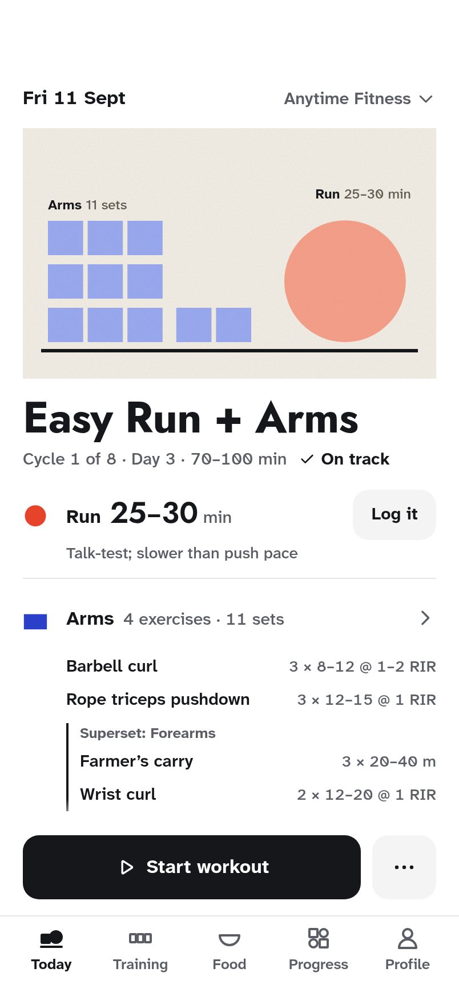
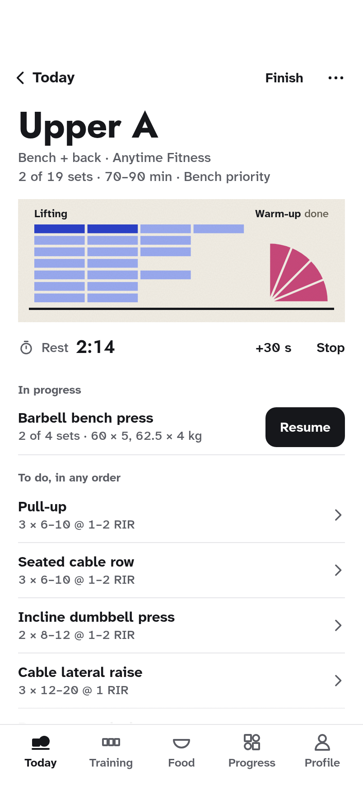
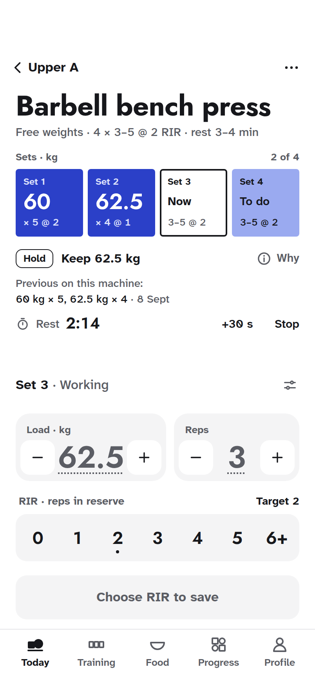
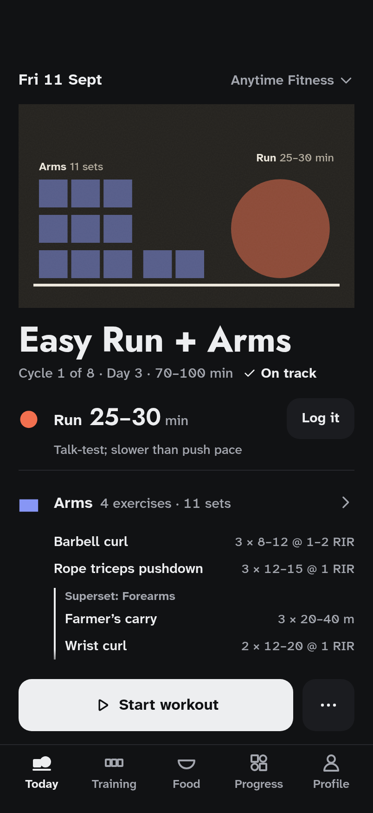
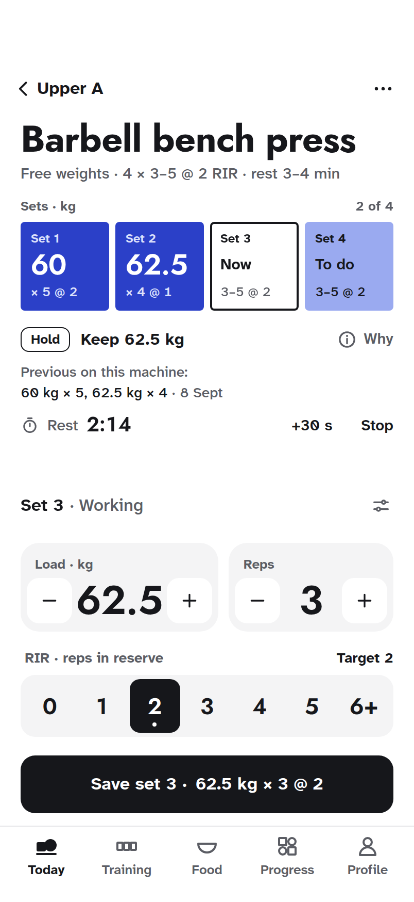
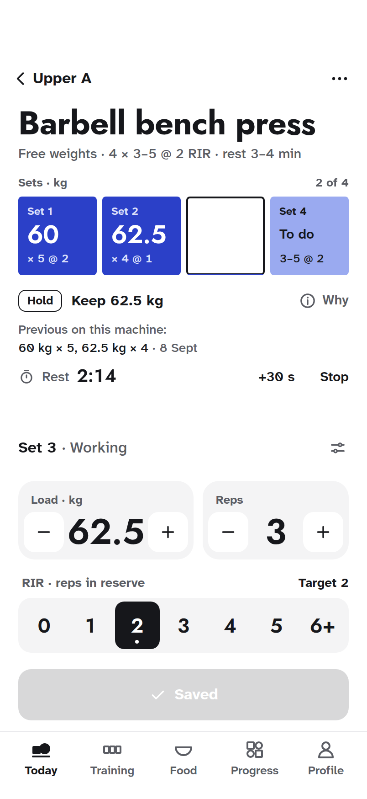
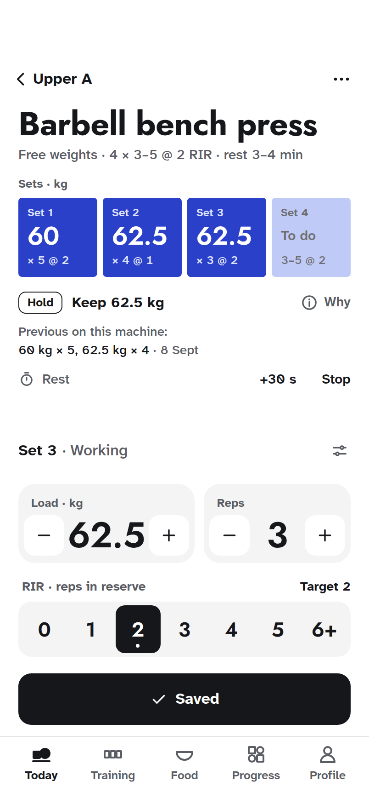
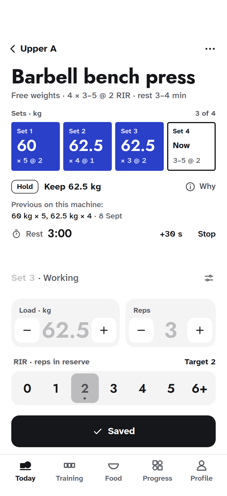
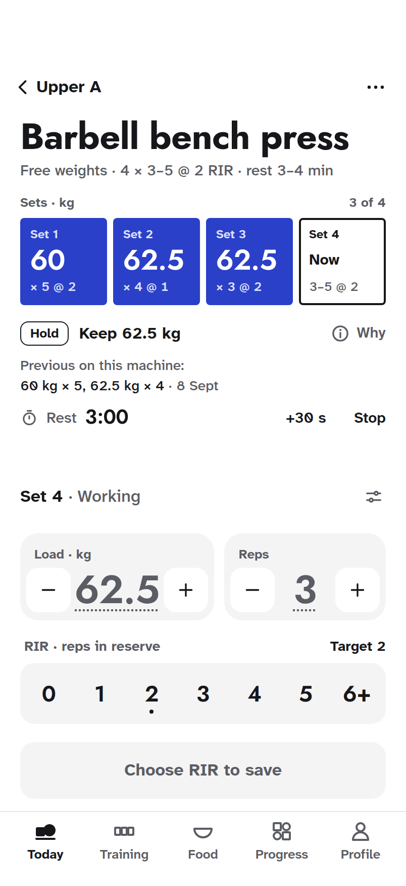

# Form v2: the art is your training

The revamp direction chosen on the Claude Design canvas (Form page, Version 8, 1 October 2026),
kept here with its source, tokens and screenshots. It is still being refined: nothing in the
application has changed. The revamp's [`PRODUCT.md`](../../../../PRODUCT.md) and
[`DESIGN.md`](../../../../DESIGN.md), at the repository root, record the product and this design
system.

Form v2 replaces the current interface, Form ([decision 0013](../../../decisions/0013-form-interface.md)),
and shares nothing with its look.

<p>
  
  
  
  
</p>

## The idea

A black-and-white app that stays out of the way. Every colour on screen is a print: generative,
Bauhaus-like art drawn from what the account has logged and nothing else, so the art is the
record and the reward at once. A slab is strength, a disc a run, a dome a ride, a wave a swim,
a quarter disc mobility, a bowl the day's food. Pigment thinned into the paper is still to do;
full ink is done; a dashed edge is skipped. Nothing is drawn as a sequence: the parts of a day,
the exercises of a workout and the meals are rows taken in any order.

## What is here

| Path                                       | What it is                                                                                                                                            |
| ------------------------------------------ | ----------------------------------------------------------------------------------------------------------------------------------------------------- |
| [`screenshots/`](screenshots/)             | Every board, phone screens at 2×, wide boards at 1×, and five frames of the signature moment                                                          |
| [`canvas/`](canvas/)                       | The 24 boards exactly as on the canvas, and a `canvas.json` that places them. Each `.dc.html` also opens in a browser on its own                      |
| [`tokens/tokens.css`](tokens/tokens.css)   | Colour (light and dark), print palettes, fonts, radii, spacing and motion as CSS custom properties                                                    |
| [`tokens/tokens.json`](tokens/tokens.json) | The same, plus the type scale, motion specs and layout rules                                                                                          |
| [`source/`](source/)                       | The generator the boards are drawn with: `form.mjs` (screens and kit), `art.mjs` (the prints), `data.mjs` (sample content), `build.mjs`, `render.mjs` |

`canvas/` and `tokens/` are written by `source/build.mjs`; change the source and rebuild rather
than editing them.

## Screens

| Board                                                                                                                           | Shows                                                                                                                          |
| ------------------------------------------------------------------------------------------------------------------------------- | ------------------------------------------------------------------------------------------------------------------------------ |
| [Today](screenshots/Form-Today-Light.png)                                                                                       | The day's print, the run and the arms plan, Start workout pinned                                                               |
| [Today, dark](screenshots/Form-Today-Dark.png)                                                                                  | The same on near-black paper                                                                                                   |
| [Today with the coach's status](screenshots/Form-Today-Coach.png)                                                               | "The coach has not planned this session yet…": the plan folds to one line to make room                                         |
| [The workout](screenshots/Form-Workout-Light.png)                                                                               | Upper A grouped by state (in progress, to do, done), its session print and the rest row                                        |
| [The workout the coach planned](screenshots/Form-Workout-Coach.png)                                                             | Lower A from the coach-plan test: a swap, three left to the programme, a skip, an addition and the notes                       |
| [Logging a set](screenshots/Form-Log-Light.png)                                                                                 | Sets as tiles, Hold · Keep 62.5 kg, rest, and the entry docked above the tab bar                                               |
| [Logging, dark, RIR chosen](screenshots/Form-Log-Dark.png)                                                                      | Save armed: the values turn ink because they are what Save records                                                             |
| [Why](screenshots/Form-Why.png)                                                                                                 | The suggestion explained, in a sheet over logging                                                                              |
| [A set is inked](screenshots/Form-Moment.png)                                                                                   | The signature moment, with [frames](#the-signature-moment) and a [reduced-motion version](screenshots/Form-Moment-Reduced.png) |
| [Progress](screenshots/Form-Progress-Light.png)                                                                                 | The quarter's print, one mark a day, and the training totals                                                                   |
| [Food](screenshots/Form-Food-Light.png)                                                                                         | The week as bowls, the day's bowl filled meal by meal, macros and meals                                                        |
| [Today at 375](screenshots/Form-Today-375.png), [440](screenshots/Form-Today-440.png) and [320](screenshots/Form-Today-320.png) | The same screen laid out from each device                                                                                      |
| [Logging in pounds at 375](screenshots/Form-Log-Pounds-375.png)                                                                 | 135 and 140 lb whole, load and reps side by side                                                                               |
| [Logging in pounds at 320](screenshots/Form-Log-320.png)                                                                        | The whole scroll: steppers stack, RIR takes two rows; the dashed line is where the first screen ends                           |
| [Food at 320](screenshots/Form-Food-320.png)                                                                                    | The days scroll, opened at today, the oldest half showing                                                                      |
| [The workout at 440](screenshots/Form-Workout-440.png)                                                                          | More of the list, nothing stretched                                                                                            |
| [Logging at 200% text](screenshots/Form-Log-Large.png)                                                                          | The whole scroll with the entry first                                                                                          |
| [Coach notes](screenshots/Form-Coach.png)                                                                                       | Every length and state of coach text, and where it goes                                                                        |
| [The alphabet](screenshots/Form-Alphabet.png)                                                                                   | The print grammar, today's sports, sports to come, sizes and busy days                                                         |
| [How the art is made](screenshots/Form-About.png)                                                                               | The direction in one page                                                                                                      |
| [System sheet](screenshots/Form-System.png)                                                                                     | Mark, icons, colour, type, spacing, radii, primitives, states and motion                                                       |

## The prints: a grammar that grows with the app

| Family    | Shape                         | Pigment               | Today's sports, and sports to come                 |
| --------- | ----------------------------- | --------------------- | -------------------------------------------------- |
| Load      | Slab, cut into its sets       | Ultramarine `#2b40c8` | Lifting, machines, bodyweight                      |
| On foot   | Disc                          | Vermilion `#e5432a`   | Running; walking (a ring), hiking (a notched disc) |
| On wheels | Dome                          | Violet `#6b48c0`      | Cycling; spin (the dome with its hub cut out)      |
| In water  | Wave                          | Viridian `#1d7a62`    | Swimming; rowing (one crest and an oar), paddling  |
| Practice  | Quarter disc, cut into drills | Rose `#c8487a`        | Mobility, warm-ups; yoga (an arc drawn in)         |
| Food      | Bowl                          | Cadmium `#f2b12a`     | The day's food, always on paper                    |
| Play      | Triangle (reserved)           | Umber `#8a5a2b`       | Climbing (stepped), racket sports (with its ball)  |

- **Context means the same on every shape.** A bar under a mark is indoors (a treadmill, an
  indoor ride, a pool); segments are its structure (sets, intervals, drills); size is time or
  distance.
- **State:** thinned pigment is to do, full ink is done, a dashed edge is skipped. Dashed means
  skipped and nothing else.
- **Adding a sport:** pick the family by how the body moves; give the sport one change cut into
  the shape, never the ground under it; it must read at 12 px beside its name; colour never
  carries it alone. A sport the app does not know yet gets its family's plain shape and its own
  name, so anything logged can be printed on day one.
- **Busy days:** forms keep slots of at least 40 px. When their names no longer fit over them
  they share one label line, and past what fits the print shows `+N` (the coach can plan up to
  8 endurance sessions a day). Shapes never overlap.
- **Dark:** the prints are pulled on near-black paper (`#23211d`) with lighter pigments and light
  ink, so the art is never the brightest thing on a dark screen.

## Style

All values are in [`tokens/`](tokens/); these are the ones that decide the look.

- **Interface colour.** Light: ground `#ffffff`, surface `#f4f4f5`, ink `#16171b`, ink 2
  `#5b5d64`, control `#85878e`. Dark: ground `#111214`, surface `#1b1c20`, ink `#edeef0`, ink 2
  `#a3a6ae`. The interface is black and white; colour only ever means a family of sport.
- **Type.** [Jost](https://fonts.google.com/specimen/Jost) for titles and figures (tabular,
  lining); [Atkinson Hyperlegible Next](https://fonts.google.com/specimen/Atkinson+Hyperlegible+Next)
  for everything read, the coach included. Both under the SIL Open Font License. Body 16/1.45;
  captions 13–15; print labels 12. Figures: Jost's zero is plain and narrower than the O; numbers
  inside sentences keep Atkinson's slashed zero. Ranges inside a figure take Atkinson's en dash.
- **Shape.** Radii 0 (prints), 4 (set tiles), 10 (segments), 14 (buttons, notes), 18 (steppers).
  Spacing 4, 8, 12, 16, 20, 24, 32, 48. The session strip carries the only shadow.
- **Targets and text.** Every target at least 44 pt; entry text at least 16 px; body text at
  least 4.5:1.

## Layout: every screen is laid out from the device

- **Devices drawn:** 402 × 874 and 440 × 956 (home indicator), 375 × 667 and 320 × 568 (none).
  Gutters are 16 pt under 360 pt wide, otherwise 20.
- **Tab bar:** 50 pt of targets and 20 pt above the home indicator (8 pt where there is none):
  74 pt in all, down from 94.
- **Logging** docks the entry (set, steppers, RIR, Save) above the tab bar and lets the record
  above it scroll, so a long exercise name, more sets or a wide figure never pushes RIR or Save
  off the screen. At 320 the whole screen scrolls and Save stays pinned.
- **Figures never truncate.** An entry steps down from 46 or 40 px until it fits (Jost's tabular
  digits measure 0.614 em). Load and reps sit side by side only where both fit at 30 px or more,
  so 140 lb stacks at 320 instead of shrinking.
- **Set tiles** are one row with one figure size: as many as fit at 74 pt share it; past that the
  row scrolls sideways, opened at the set you are on. A saved set reads `× 5 @ 2`, the notation
  the targets use.
- **RIR** keeps seven choices in a row while each is 44 pt wide, and takes two rows below that.
  `6+` opens 6 to 10, the rest of the app's range.
- **Short screens fold detail behind a tap:** Today keeps the plan one tap away; logging moves
  the last session into Why.

## Coach and LLM text

- One quiet block for everything the coach writes, and for the app's own recovery check under
  its own name: attributed, black on grey, never on the art, never in colour, at most one per
  screen.
- At most two lines inline, clamped by the browser so it holds at any text size; More opens the
  whole text in a sheet, which scrolls (a rationale may run to 3,000 characters).
- A note on an exercise sits under its targets, marked with the coach's glyph, at most two lines.
  The app's own limits: a note 200 characters, a summary 400, a warm-up 8 lines of 160.
- Statuses take the note's place and say whose targets apply: planning (a turning arc), not
  planned yet (with "Ask the coach to plan it now"), could not finish or prepare (a warning), or
  planned for another gym.
- When the coach needs an answer: the request, its question, a field for the answer, Send answer
  and "I no longer want this".
- Placement: Today under the day's title; the workout under its title and on each exercise;
  logging leads with the suggestion and keeps the reason in Why. Never between the steppers and
  Save, never on a print.

## The signature moment

A set is inked. Save presses (120 ms), the tile's text clears (80 ms), ultramarine fills the tile
from its bottom edge (420 ms, `cubic-bezier(0.65, 0, 0.35, 1)`), set 4 takes the outline, the
values go back to suggestions, RIR clears and rest restarts at 3:00. Every swap in place goes out
in 80 ms before the new word comes in 120 ms. With reduced motion the tile cross-fades in 150 ms
and nothing moves.

<p>
  
  
  
  
  
</p>

## Where the content comes from

Every figure and line of copy is taken from this repository; nothing is invented.

| Content                                                     | Source                                                                                                                      |
| ----------------------------------------------------------- | --------------------------------------------------------------------------------------------------------------------------- |
| Today: Fri 11 Sept, Easy Run + Arms                         | `src/app/(preview)/preview/page.tsx`                                                                                        |
| Upper A, Lower A and the cycle's targets                    | `src/db/seed/data/program.ts`                                                                                               |
| Bench sets, Hold · Keep 62.5 kg                             | the [feature inventory](../features.md); the reason from `src/domain/progression.ts`                                        |
| Pounds: squat 135 lb × 5 @ 2, 140 lb × 6 @ 2                | `scripts/dev/audit-workout.mjs`; rest starts at the slot's minimum (`use-set-rows.ts`)                                      |
| The coach's Lower A plan and its notes                      | `src/server/repositories/coach-plans.test.ts`, drawn with `planLine`, `prescription` and `coachPlanSummary`                 |
| Coach statuses                                              | `src/app/(app)/today/coach-actions.tsx`, `today-view.tsx`                                                                   |
| Coach texts                                                 | `src/app/(preview)/preview/coaching/page.tsx`, `coaching-workflow.test.ts`, `scripts/dev/seed-audit.ts`, `request-list.tsx` |
| Recovery check, warm-up rule, RIR range, limits             | `src/domain/recovery.ts`, `use-set-rows.ts` (ADR 0038), `src/domain/effort.ts`, `src/domain/plan-limits.ts`                 |
| The quarter: 22 strength, 11 runs (45 km), 3 rides, 3 swims | `scripts/dev/seed-audit-history.ts`, account `vinit`, 6 Jul – 30 Sept 2026                                                  |
| Food: Fri 25 Sept, 1,152.5 of 2,300 kcal                    | `src/app/(preview)/preview/food/page.tsx`                                                                                   |

## How it was checked

- **Accessibility script** on all 24 boards: text contrast (lowest 5.43:1), targets of 44 pt,
  entry text of 16 px, obscured text. What it still flags is expected: rows scrolling under the
  tab bar, the screen behind the Why sheet's scrim, and screen-reader-only labels.
- **Impeccable's detector:** clean on 23 boards; on Why it reports the screen under the modal
  sheet.
- **An independent design review** (Impeccable's critique) scored 28/40 on Nielsen's heuristics.
  This version applies its fixes: the docked logging entry, Save kept under the Why sheet,
  clamped coach text and its answer flow, Today with a coach status, prints that lay out busy
  days and short heights, variants that no longer collide, the `× 5 @ 2` tiles, Save as warm-up,
  the 200% board's entry first, dark paper and dashed meaning only skipped. Kept as it was: the
  tab bar on the logging screen.

## Not drawn yet

A finished-workout summary, supersets inside the workout's state groups, and the archetypes
beyond Today, logging, the workout, Progress and Food (onboarding, settings, history detail).
The states sheet on the [system sheet](screenshots/Form-System.png) covers offline, saving,
failure, loading, empty and done.

## Rebuilding

```sh
node docs/ui-redesign/revamp/form-v2/source/build.mjs    # boards, canvas.json and tokens
node docs/ui-redesign/revamp/form-v2/source/render.mjs   # screenshots; fonts load from Google Fonts
```

After changing a board that scrolls as a whole (the system sheet, About, the alphabet, coach
notes, 200% text, the 320 whole scrolls), run `render.mjs --measure`, build again and render
again. `render.mjs` uses the repository's Playwright; if its browser is not installed, point
`CHROMIUM_PATH` at a Chromium executable.

A change to a token, a rule or a component goes into `DESIGN.md` in the same change, with its
sidecar, `.impeccable/design.json`, regenerated (Impeccable's `document` step), so the next
session builds from what the boards show.
