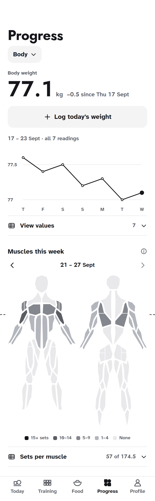
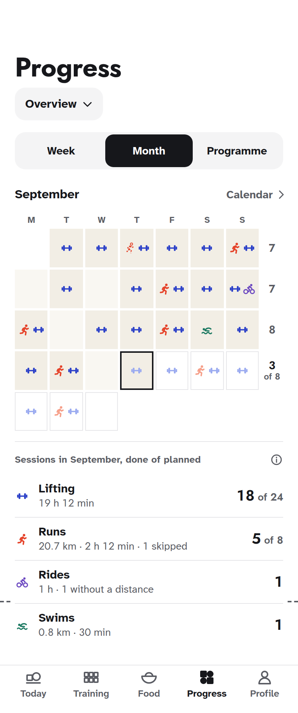
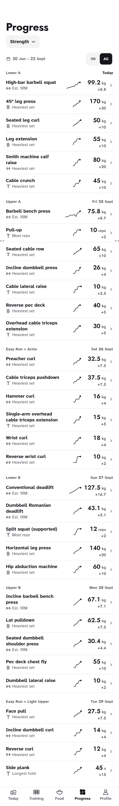
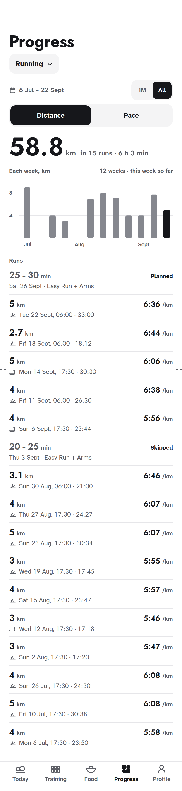
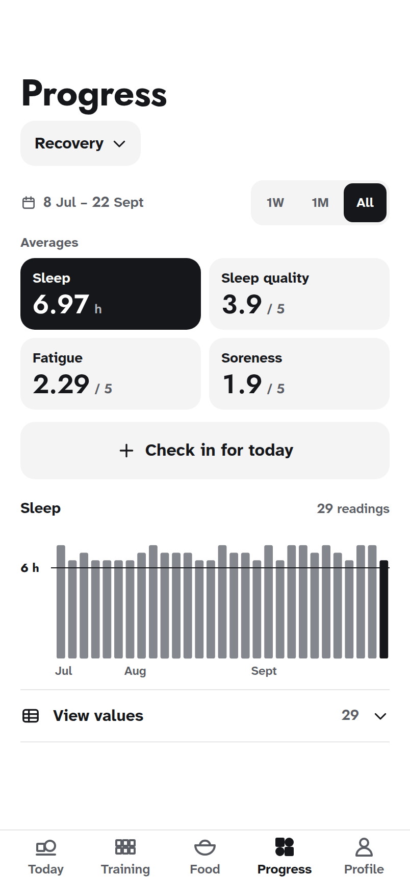

# Progress, revamped: the mockups

Drawn on 5 October 2026 on the Claude Design canvas **Progress revamp**, for review before
anything is built, and kept here with its boards and screenshots. Nothing in the application has
changed. The boards use Form v2 ([`DESIGN.md`](../../../../DESIGN.md)) and show the account as it
stood on Thu 24 Sept 2026, day 43 of 56 of the 8-Week Strength + Aesthetics Hybrid.

  
  
  
  
  

## What was asked, and what the boards do

| The ask                                                               | What the boards do                                                                                                                                                                                                                                                                                                                                                                                                         |
| --------------------------------------------------------------------- | -------------------------------------------------------------------------------------------------------------------------------------------------------------------------------------------------------------------------------------------------------------------------------------------------------------------------------------------------------------------------------------------------------------------------- |
| Change the order of the sections; Body first                          | Progress opens on Body, and the section sheet lists Body, Overview, Strength, Running, Recovery, History: you, then the record, then each subject, then the archive. Body first is the owner's decision; the order of the rest is proposed                                                                                                                                                                                 |
| One total instead of three (the programme's, the month's, the week's) | Overview is one calendar and one list of totals. Week, Month or Programme chooses the span; each week's sessions stand at the end of its row, and under the calendar each sport says what was done of what was planned, with its time and distance. Training totals, the month's strip and Weekly sessions are gone, because this says all of it once. An alternative board puts the three spans side by side in one table |
| Do Strength's Reps and RIR charts earn their place?                   | No: neither is charted. Heavier load for fewer reps is progress, so a reps line alone misreads it, and RIR is the effort the programme asks for, not a result. Each lift gets one strength line chosen by what the lift is, with Volume beside it, and every set of every session keeps its load, reps and RIR                                                                                                             |
| Filters that fit the data                                             | The funnel and the header's dates go everywhere but History. Each section has one range row, directly above what it changes. It names the dates drawn and offers only the ranges the data fills: seven days of weight get no buttons, just "17 – 23 Sept · all 7 readings", and with under three months of data 3M and 1Y would draw what All draws, so they are not offered                                               |
| No redundant information, but all the data                            | Each fact is said once per screen, and nothing was dropped without a new home (see Section by section)                                                                                                                                                                                                                                                                                                                     |
| The next action obvious on every screen                               | Body: Log today's weight. Overview: today ringed, the days to come drawn as planned. Strength: today's session first, and every lift opens its sessions. Running: the next planned run leads the list. Recovery: Check in for today. History: any entry opens                                                                                                                                                              |
| History is fine                                                       | Kept as it is, and the only section that keeps the filter sheet, because it filters by activity, gym, exercise and machine                                                                                                                                                                                                                                                                                                 |

## Decided with the owner, 5 October 2026

1. **Body first.** Progress opens on Body, and Body leads the section sheet. Recorded in
   [`DESIGN.md`](../../../../DESIGN.md) under Sections.
2. **The long span is the current programme**, counted from its first day. With no programme
   running, it is the last 12 weeks.
3. **Totals compare done with planned.** Days still to come are thinned icons on the calendar and
   a skipped part is dashed, so the next session is always in sight.

## Rules the boards follow

- **A range is offered** only when the data goes back further than it and it still holds two
  readings; All stands beside it. The longest range offered of 3 months or less is chosen first.
  The dates beside the buttons say what is drawn, and a tap on them sets exact dates.
- **One strength line per lift.** Est. 1RM (Epley, the app's own rule) for barbell and dumbbell
  lifts prescribed at 10 reps or fewer. The heaviest set for machines, cables and higher-rep work,
  each machine its own line. Most reps for bodyweight, a weighted session its own line. The
  longest hold for timed work.
- **Planned counts tasks**, as the programme does: a day that lifts and runs plans one of each.
  Rides and swims outside the programme count as done and are never planned. Distances are never
  added across sports; time is.
- **Every chart is ink** and keeps its table of values. Pigment stays in the calendar's icons and
  the sports' marks. An axis never repeats the dates its range row names: weekdays under a week,
  months under months.

## Section by section

| Section  | What it shows                                                                                                                                                       | Gone or moved                                                                                                                                       |
| -------- | ------------------------------------------------------------------------------------------------------------------------------------------------------------------- | --------------------------------------------------------------------------------------------------------------------------------------------------- |
| Body     | Weight: the latest figure, its change, the line and its values. Muscles this week: the map, and each muscle's sets done of planned; a tap shows that muscle's weeks | Moved in: Strength's Sets by muscle, one tap on the map. Gone: the header's dates                                                                   |
| Overview | One calendar for the chosen span, the days ahead drawn as planned, each week's count at the end of its row, then done of planned per sport                          | Gone: Training totals (now Programme), the month's totals strip (now the rows), Weekly sessions (now each row's count), the range caption           |
| Strength | Every lift with its trend, latest figure and change, grouped by programme day with today's session first; a lift opens its line and every session's sets            | Gone: the exercise select and the five-way switch (Load, Reps, Volume, RIR and e1RM become one strength line and Volume). Moved out: Sets by muscle |
| Running  | Distance or Pace, one headline, the weeks, then every run, the planned and skipped ones included                                                                    | Gone: Duration as its own chart (each run keeps its time) and Overview's runs-per-week chart                                                        |
| Recovery | Four averages that choose the chart, the chosen measure's readings, and every reading behind View values                                                            | Gone: the second count, the Range average block (each tile is the average) and Recent check-ins (the same rows as View values)                      |
| History  | As it is                                                                                                                                                            | Nothing                                                                                                                                             |

## Open questions

1. Check in for today needs a check-in that is not tied to a workout. Build it, or send the button
   to Today?
2. Strength lists lifts by programme day, today's first. Would last trained, or biggest change,
   be a better order?
3. Does Week earn its place in the switch, when this week's row already says "3 of 8"?
4. Once there are weeks of weigh-ins, add a 7-day average line to body weight?
5. Overview: the Week, Month, Programme switch, or all three side by side in one table? The table
   needs no tap, but it holds three times the numbers, and its week column repeats this week's
   "3 of 8" by sport.

## What is here

| Path                           | What it is                                                                        |
| ------------------------------ | --------------------------------------------------------------------------------- |
| [`screenshots/`](screenshots/) | Every board: the phone boards at 2×, the read-me at 1×                            |
| [`canvas/`](canvas/)           | The 16 boards as they stand on the canvas, and the `canvas.json` that places them |

Each board is a static page and opens in a browser at phone size. The boards link to each other:
the section button opens the sheet, a lift opens its page, Log today's weight opens its sheet and
the span switch moves between Week, Month and Programme.

## The canvas

| Row                                  | Boards                                                                                                                                                                                                                                                                                                                              |
| ------------------------------------ | ----------------------------------------------------------------------------------------------------------------------------------------------------------------------------------------------------------------------------------------------------------------------------------------------------------------------------------- |
| Read me                              | [What was asked, the decisions, the rules and the open questions](screenshots/Main.png)                                                                                                                                                                                                                                             |
| The six sections, in their new order | [Body](screenshots/Body.png), where Progress opens; [Overview, Month](screenshots/Overview.png); [Strength](screenshots/Strength.png); [Running](screenshots/Running.png); [Recovery](screenshots/Recovery.png); [History](screenshots/History.png). Each is a whole scroll; dashes in the margins mark where the first screen ends |
| The next step on each screen         | [Choosing a section](screenshots/Picker.png), [logging today's weight](screenshots/Body-Log.png), [one lift](screenshots/Strength-Lift.png), [a muscle's weeks](screenshots/Body-Muscles.png)                                                                                                                                       |
| Overview's other spans               | [Week](screenshots/Overview-Week.png), [Programme](screenshots/Overview-Programme.png), and [the alternative: all three in one table](screenshots/Overview-Table.png)                                                                                                                                                               |
| Body later, and dark                 | [Months of readings, where range buttons appear](screenshots/Body-Months.png), [dark](screenshots/Body-Dark.png)                                                                                                                                                                                                                    |

## Where the figures come from

The programme and its prescriptions are the seeded 8-Week Strength + Aesthetics Hybrid. Runs,
weights and check-ins come from the audit account. Which days were done is illustrative, worked
out with the app's own rules: one programme day a day, Epley's estimate, and its muscle counting
(a primary muscle counts the set, a secondary half). Lines and bars are placed with the app's own
chart geometry (`src/components/ui/ink-chart-geometry.ts`).

## How it was checked

Every board was rendered in headless Chromium at 402 × 874, measured for overflow and clipped
text, and looked at, the dark board and the read-me included. The Impeccable detector ran over
every board twice; three warnings remain and none is a defect: a muscle's weeks is a scrolled view,
so the screen's 36-pt title sits above the board (a flat type scale); a line height on the read-me
board; and the programme calendar's last planned day, whose date sits inside its edge like every
other day's. Nothing has been checked on a phone.
